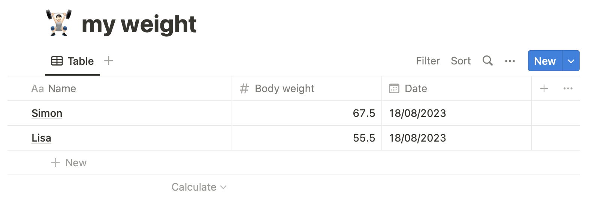

## Raspberry Pi based Smart Home Hub
I plan to build a pi based smart home hub which can help me better organize my life. Some key features can be:
- Audio speech recognition(ASR)
- Text to speech(TTS)
- A user-friendly Dashboard
- I/O extension, reading sensor data, control actuators, etc.
- Database for data synchronization

### Software setup
Step by step, design, implement, and test each module. 

#### Test Whisper API for speech recognition 
Dependencies installation 
```
sudo apt-get update 
sudo apt-get upgrade 
sudo apt-get install portaudio19-dev 
sudo pip install pyaudio

sudo pip install pydub
sudo apt-get install lame

sudo pip install numpy openai
```

Run the code
```
python3 pi_whisper_api.py

//it will wait for active audio input and detect audio ending
```

#### Test Azure TTS API for text to speech
Dependencies installation 
```
//Generated audio play
sudo apt-get install portaudio19-dev 
sudo pip install pyaudio

//Azure TTS SDK and xml tree file editing
pip install azure-cognitiveservices-speech
pip install elementpath  
```
Run your test
```
usage: pi_azure_tts_api.py [-h] --text TEXT [--voice_name VOICE_NAME]
                           [--radio_speed RADIO_SPEED] [--emotion EMOTION]
                           [--emotion_degree EMOTION_DEGREE]
                           [--output_file OUTPUT_FILE]
```

#### Test Notion Database 
This [tutorial](https://www.youtube.com/watch?v=M1gu9MDucMA) helped me. Tested Database page creation/query/update/delete. 
[Here](https://www.notion.so/my-integrations) to create New Notion integrations.

My Notion page:


#### Test OpenAI Function Calling
Check out what is [Function Calling](https://openai.com/blog/function-calling-and-other-api-updates).
This [blog](https://zhuanlan.zhihu.com/p/637002733?utm_id=0) helped me.


## License
This project is licensed under the MIT License - see the [LICENSE](LICENSE) file for details.